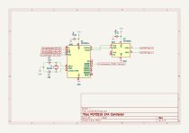
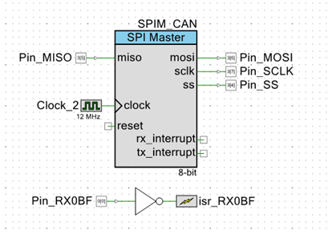
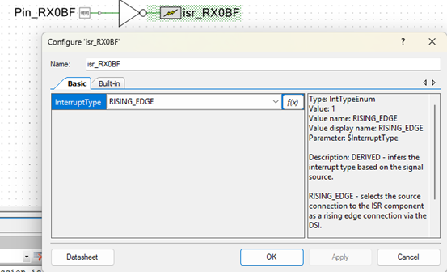
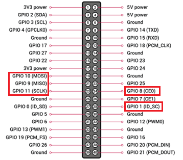

# can-controller
Interface to CAN controllers

This library implements access to CAN drivers on different platforms.

Coverages of support are currently:

|              | mcp2515 |
| ------------ | :-----: |
| PSoC         |    v    |
| Raspberry Pi |    v    |

## Getting Started
The CAN bus configuration is fixed to 1 Mbps communication.

Set up the CAN controller. Following is the schematic of MCP2515 controller.



Connect this controller to a CAN bus.

Next, connect to the processor. The processor should have a set of SPI pins and a GPIO pin where pin down interrupt can be enabled.

For PSoC, create a SPI Master component and an ISR that is connected by an input pin through an inverter. The names must be `SPIM_CAN` and `isr_RX0BF`. The controller is tested with clocks 8 MHz and 12 MHz (SPI clock 4 MHz and 6 MHz respectively). But the MCP2515 controller accepts SPI clock up to 10 MHz.



No special configuration is necessary for `SPIM_CAN`, but change ISR interrupt type to `RISING_EDGE` (which makes falling edge by combination with the inverter).




For Raspberry PI, use the primary SPI ports and GPIO 1 for receiving the interrupt signal.



In the application code, call API method `can_init()` at the beginning of the program.

```c
#include "can-controller/api.h"
#include "can-controller/device/mcp2515.h"

int main() {
  if (can_init()) {
    return -1;
  }

  // put your application code here

  return 0;
}
```

And implment message received callback in your application, for example:

```c
void can_consume_rx_message(can_message_t *message) {
  queue_add(message);
}
```

Note that this method is called by an interrupt handler, so the execution should be quick.
Also, the application is responsible to release the `message`.  Use API method `can_free_message()` to release the memory.

This callback method is invoked whenever the controller receives a message.

Type `can_message_t` carries a CAN message. It is a structure defined a the following:

```c
typedef struct can_message {
  uint32_t id;
  uint8_t is_extended;
  uint8_t is_remote;
  uint8_t data_length;
  uint8_t data[8];
} can_message_t;
```

In order to send a CAN message, use API method `can_send_message()` such as:

```c
can_message_t *message = can_create_message();
message->id = 0x123;
message->is_extended = 0;
message->is_remote = 0;
message->data_length = 5;
memcpy(message->data, "hello", 5);
can_send_message(response);
```

Note that the message object must be created by API method `can_create_message()`.